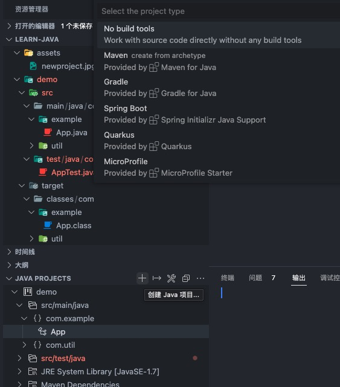

# Java调试说明

## 项目说明

当前目录中有多个项目，如果需要创建新的项目，可以在工作栏左下角点击 + 号，选择项目类型即可。

## Maven

处于maven组织结构中，创建的java类，插件会自动编译到 target/classes/com目录下。因此不需要手动处理。
运行某个具体类，可以 `java -cp demo/target/classes com.example.App` 即可执行

## 单文件

运行此类测试文件，可以 `java Hello.java` 既可执行

